# Crypto Streaming Pipeline
---

A production-grade real-time data engineering pipeline that streams live cryptocurrency market data from Binance, processes it through Apache Flink, stores it in Cassandra and DuckDB, exports to a GCS data lake, and visualises everything in a live Grafana dashboard — all containerised with Docker Compose and cloud-provisioned with Terraform.

Problem Statement
Cryptocurrency markets operate 24/7, generating thousands of price events per second across hundreds of trading pairs. Traditional batch ETL pipelines are fundamentally unsuited to this domain — a job running hourly misses rapid price movements, anomalies, and trading signals that matter most in real time.

This project builds a streaming data pipeline that:

- Ingests live crypto price ticks every ~500ms from Binance
- Validates, cleans, and transforms data in real time using Apache Flink
- Persists results to both a real-time store (Cassandra) and a historical analytical store (DuckDB)
- Exports aggregated candles to a GCS cloud data lake
- Surfaces everything in a live Grafana dashboard with multi-channel alerting
- Monitors pipeline health via Prometheus with automated alerts
---


## Architecture

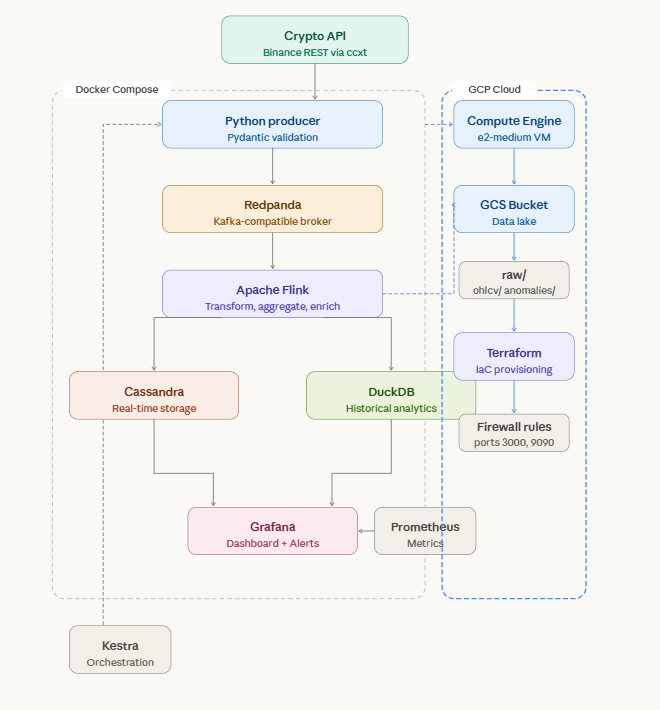

Every component runs as a Docker container. One `docker-compose up --build` starts the entire stack.

---
## Cloud Infrastructure (GCP+Terraform)

This project uses **Google Cloud Platform** for cloud deployment, provisioned with **Terraform** (Infrastructure as Code).

### Resources provisioned

| Resource | Type | Purpose |
|---|---|---|
| `crypto-pipeline-vm` | Compute Engine e2-medium | Hosts the pipeline stack |
| `crypto-data-lake` | GCS Bucket | Stores OHLCV exports and anomalies |
| `allow-crypto-pipeline-ports` | Firewall rule | Opens ports 3000, 9090, 8085 |

### To provision cloud infrastructure
```bash
cd terraform
terraform init
terraform plan
terraform apply
```

### Data Lake structure
```
gs://de-zoomcamp-2026-XXXXXX-crypto-data-lake/
├── raw/          ← raw tick data
├── ohlcv/       ← 1-minute candles (partitioned by date/symbol)
│   └── 2026/03/30/
│       ├── BTC-USDT_0703.json
│       ├── ETH-USDT_0703.json
│       └── SOL-USDT_0703.json
└── anomalies/  ← detected price jumps and volume spikes
    └── 2026/03/30/
        └── BTC-USDT_143022.json
```

## Data Warehouse — Apache Cassandra
Cassandra serves as the operational data warehouse with tables designed around query patterns rather than data shape.

Table optimisation
price_ticks — partitioned by symbol so all BTC rows live on the same node. Clustered by timestamp DESC so the latest price is always the first row. The Grafana live price query reads exactly 1 row with no full scan.

```
PRIMARY KEY ((symbol), timestamp)
WITH CLUSTERING ORDER BY (timestamp DESC)
AND default_time_to_live = 604800;  -- 7 days TTL
```

**price_ticks** — partitioned by `symbol` so all BTC rows
live on the same node. Clustered by `timestamp DESC` so the
latest price is always the first row. The Grafana query
`SELECT price FROM price_ticks WHERE symbol='BTC/USDT' LIMIT 1`
reads exactly 1 row with no full scan.

**ohlcv_1min** — same partition/cluster pattern. Supports
30-day candlestick queries with zero full-table scans.
30-day TTL prevents unbounded growth.

**anomalies** — flagged price jumps (>2%) and volume spikes
(>500%) stored with symbol partitioning for fast lookup.

---
## Tech Stack

| Layer | Tool | Purpose |
|---|---|---|
| Data source | Binance API via `ccxt` | Live crypto price feeds |
| Producer | Python 3.11 + Pydantic | Fetch, validate, publish |
| Message broker | Redpanda | Kafka-compatible streaming broker|
| Stream processor | Apache Flink 1.18 | ETL, OHLCV aggregation, anomaly detection |
| Real-time DB | Apache Cassandra 4.1 | Low-latency point lookups |
| Historical DB | DuckDB | Analytical queries over OHLCV history |
| Cloud data lake | Google Cloud Storage | OHLCV and anomaly exports |
| Cloud IaC | Terraform | GCP infrastructure provisioning |
| Metrics | Prometheus | Pipeline health scraping |
| Dashboard | Grafana | Live charts, multi-channel alerts |
| Orchestration | Kestra | Scheduled health checks, flow management |
| Infrastructure | Docker Compose | Full local stack |

---

## Features

- **Live price streaming** — BTC, ETH, SOL, BNB, XRP, DOGE updating every ~500ms from Binance
- **Pydantic validation** — every tick validated at source before entering the pipeline
- **Flink ETL** — deduplication, stale tick filtering, null fill, price rounding, anomaly detection
- **1-minute OHLCV candles** — computed by Flink windowing and stored in both Cassandra and DuckDB
- **Anomaly detection** — price jumps >2% and volume spikes >500% flagged and stored separately
- **GCS data lake** — real-time OHLCV and anomaly exports to Google Cloud Storage
- **Terraform IaC** — full GCP infrastructure defined as code, reproducible with one command
- **Live Grafana dashboard** — 10 panels covering live prices, volume, pipeline throughput, and error rates
- **Multi-channel alerts** — Grafana alert rules firing to Gmail, Telegram, and Webhook
- **Prometheus metrics** — scraping producer, Flink job, Redpanda, and Flink JobManager
- **Kestra orchestration** — scheduled pipeline health checks every 5 minutes
- **Auto-restart** — all services configured with `restart: unless-stopped`

---

## Project Structure

```
project1/
│
├── docker-compose.yml
├── .env                            # environment variables (not committed)
├── .gitignore
├── README.md
│
├── terraform/
│   ├── main.tf                     # GCP VM, GCS bucket, firewall rules
│   └── variables.tf                # project_id, region, zone
│
├── producer/
│   ├── Dockerfile
│   ├── requirements.txt
│   ├── main.py                     # entry point
│   ├── producer.py                 # Redpanda publish logic
│   ├── fetcher.py                  # Binance API via ccxt
│   └── schemas.py                  # Pydantic validation models
│
├── flink/
│   ├── Dockerfile
│   ├── requirements.txt
│   ├── jobs/
│   │   ├── crypto_job.py           # main Flink streaming job
│   │   ├── transformations.py      # ETL logic
│   │   └── sinks.py                # Cassandra + DuckDB + GCSSink
│   └── conf/
│       └── flink-conf.yaml         # Flink + Prometheus reporter config
│
├── cassandra/
│   └── init/
│       └── schema.cql              # keyspace + table definitions
│
├── duckdb/
│   └── data/
│       └── crypto_history.duckdb   # historical OHLCV archive
│
├── prometheus/
│   └── config/
│       └── prometheus.yml          # scrape targets config
│
├── grafana/
│   ├── config/
│   │   └── grafana.ini             # SMTP + unified alerting config
│   └── provisioning/
│       ├── datasources/
│       │   └── prometheus.yml
│       └── dashboards/
│           ├── dashboard.yml
│           └── crypto.json         # full dashboard definition
│
└── kestra/
    └── flows/
        ├── producer_flow.yml
        └── flink_job_flow.yml
```

---

## Prerequisites

- [Docker Desktop](https://www.docker.com/products/docker-desktop/) (Windows/Mac/Linux)
- [Terraform](https://www.terraform.io/) — for GCP cloud provisioning
- [Google Cloud account](https://console.cloud.google.com/) — free tier sufficient
- 8GB+ RAM recommended (Kestra is resource-heavy — see notes below)
- Internet connection (pipeline fetches live data from Binance)

---

## Quick Start

### 1. Clone the repository

```bash
git clone https://github.com/elijaydot/datatalks-data-engineering-bootcamp/tree/main/project1.git
cd project1-crypto-streaming-pipeline
```


### 2. Configure environment variables

Copy `.env.example` to `.env` and fill in your values:

```bash
cp .env.example .env
```

```env
GRAFANA_PASSWORD=your_secure_password
CRYPTO_SYMBOLS=BTC/USDT,ETH/USDT,SOL/USDT,BNB/USDT,XRP/USDT,DOGE/USDT
CRYPTO_EXCHANGE=binance
FETCH_INTERVAL_MS=500
GCS_BUCKET=your-gcs-bucket-name
```

> No Binance API key is required — the pipeline uses public market data endpoints.

### 3. (optional) Provision cloud infrastructure
```
cd terraform
terraform init
terraform apply
cd ..
```

### 4. Start the stack

```bash
docker compose up --build
```

First build takes 5-10 minutes while Docker pulls images and installs dependencies. Subsequent starts are much faster.

### 4. Verify the pipeline is running

```bash
# Check all containers are up
docker ps

# Watch live producer logs
docker logs crypto_producer --follow

# Verify messages in Redpanda
docker exec -it redpanda rpk topic consume crypto-raw-ticks --num 5

# Check Cassandra has data
docker exec -it cassandra cqlsh -e "USE crypto; SELECT symbol, price FROM price_ticks WHERE symbol = 'BTC/USDT' LIMIT 5;"
```

---

## Accessing the UIs

| Service | URL | Credentials |
|---|---|---|
| Grafana dashboard | http://localhost:3000 | admin / your password |
| Prometheus | http://localhost:9090 | — |
| Kestra orchestration | http://localhost:8085 | — |
| Flink Web UI | http://localhost:8083 | — |
| Redpanda Console | http://localhost:8086 | — |
| Producer metrics | http://localhost:8000/metrics | — |
| Flink job metrics | http://localhost:8001/metrics | — |

---

## Grafana Dashboard

The dashboard has three rows:

**Row 1 — Live market data** (Prometheus source)
- BTC/USDT live price chart
- ETH/USDT live price chart
- SOL/USDT live price chart
- BNB/USDT live price chart
- XRP/USDT live price chart
- DOGE/USDT live price chart
- All coins price comparison
- Trading volume — all coins
- Messages sent to Redpanda per second

**Row 2 — Operational stats** (Prometheus + Cassandra)
- Producer errors counter
- BTC/USDT latest tick stat
- ETH/USDT latest tick stat
- SOL/USDT latest tick stat
- BNB/USDT latest tick stat
- XRP/USDT latest tick stat
- DOGE/USDT latest tick stat

**Alert rules configured:**
- Producer silent — fires if no messages for 2+ minutes
- Producer errors — fires on any error count increase
- Flink job unreachable — fires if Prometheus cannot scrape flink-job
- BTC price drop — fires if BTC drops >3% in 5 minutes

Alerts notify via Gmail, Telegram, and Webhook (configurable in Grafana → Alerting → Contact points).

---


## Flink ETL Pipeline

The Flink job (`flink/jobs/crypto_job.py`) processes each message through a series of stages:

```
Raw tick from Redpanda
        ↓
1. Parse JSON — deserialise and validate required fields
        ↓
2. Filter stale ticks — drop ticks older than 30 seconds
        ↓
3. Deduplicate — drop exact symbol + timestamp duplicates
        ↓
4. Normalise — round price to 2dp, fill null bid/ask
        ↓
5. Anomaly detection — flag price jumps >2%, volume spikes >500%
        ↓
        ├──→ Write tick to Cassandra (price_ticks)
        ├──→ Write anomaly to Cassandra (anomalies) if detected
        └──→ Accumulate into 1-min OHLCV window
                    ↓ (every minute)
             Flush completed windows
                    ↓
        ├──→ Write OHLCV to Cassandra (ohlcv_1min)
        ├──→ Write OHLCV to DuckDB (ohlcv)
        └──→ Export OHLCV to GCS (ohlcv/YYYY/MM/DD/SYMBOL_HHMM.json)
```

---

## Cassandra Schema

```sql
-- Real-time price ticks (TTL: 7 days)
CREATE TABLE crypto.price_ticks (
    symbol      TEXT,
    timestamp   TIMESTAMP,
    price       DOUBLE,
    volume      DOUBLE,
    exchange    TEXT,
    bid         DOUBLE,
    ask         DOUBLE,
    PRIMARY KEY ((symbol), timestamp)
) WITH CLUSTERING ORDER BY (timestamp DESC);

-- 1-minute OHLCV candles (TTL: 30 days)
CREATE TABLE crypto.ohlcv_1min (
    symbol       TEXT,
    window_start TIMESTAMP,
    open         DOUBLE,
    high         DOUBLE,
    low          DOUBLE,
    close        DOUBLE,
    volume       DOUBLE,
    tick_count   INT,
    PRIMARY KEY ((symbol), window_start)
) WITH CLUSTERING ORDER BY (window_start DESC);

-- Anomaly detection results (TTL: 30 days)
CREATE TABLE crypto.anomalies (
    symbol         TEXT,
    timestamp      TIMESTAMP,
    price          DOUBLE,
    volume         DOUBLE,
    anomaly_type   TEXT,
    anomaly_detail TEXT,
    PRIMARY KEY ((symbol), timestamp)
) WITH CLUSTERING ORDER BY (timestamp DESC);
```

---

## Prometheus Metrics

| Metric | Source | Description |
|---|---|---|
| `crypto_price{symbol}` | flink-job | Latest price per symbol |
| `crypto_volume{symbol}` | flink-job | Latest volume per symbol |
| `producer_messages_sent_total{symbol}` | producer | Total messages published |
| `producer_errors_total{symbol}` | producer | Total publish errors |
| `up{job="flink-job"}` | prometheus | Flink job reachability |
| `up{job="redpanda"}` | prometheus | Redpanda reachability |

---
## Relevant Screenshots
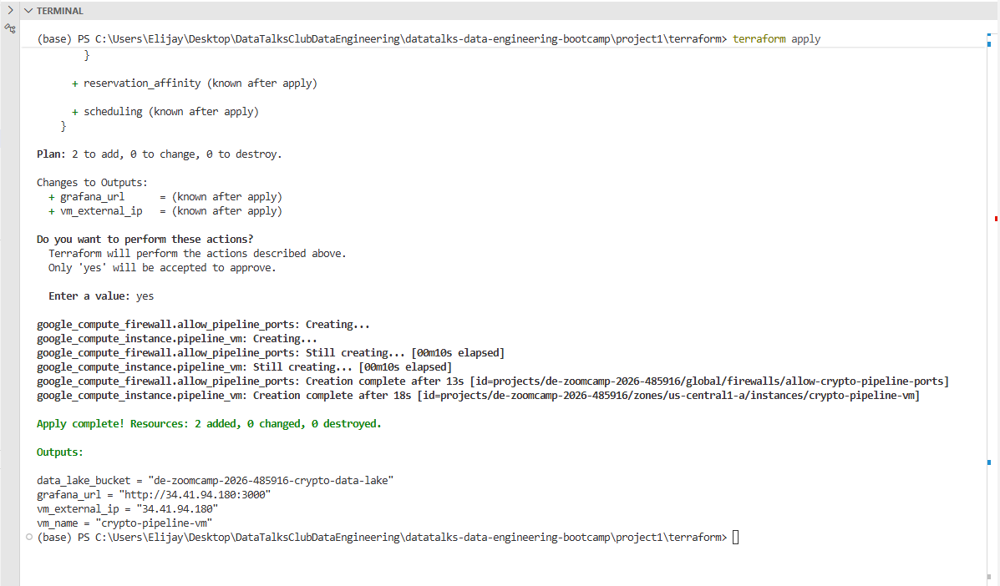
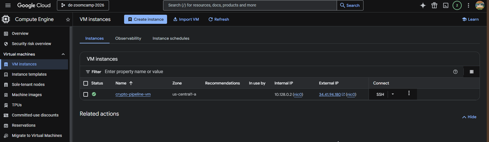
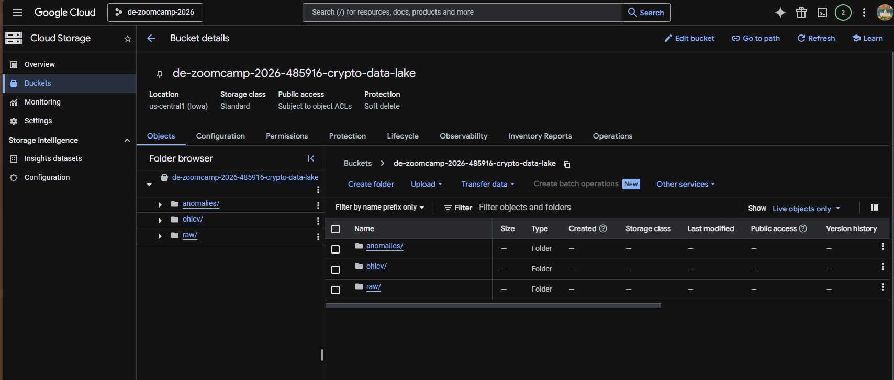
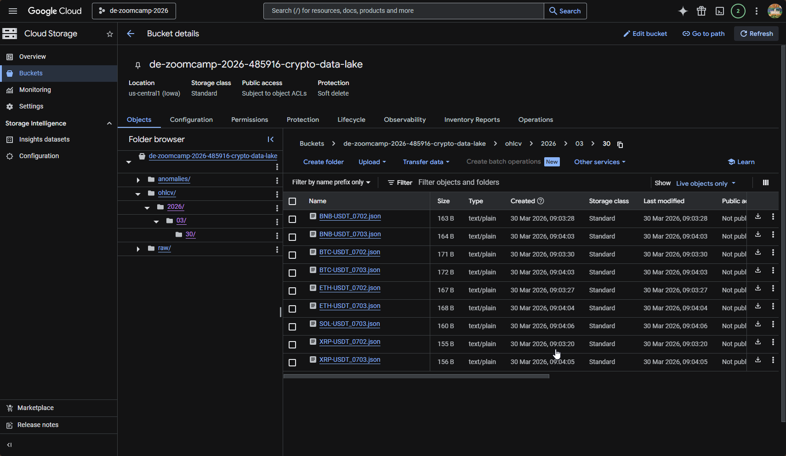
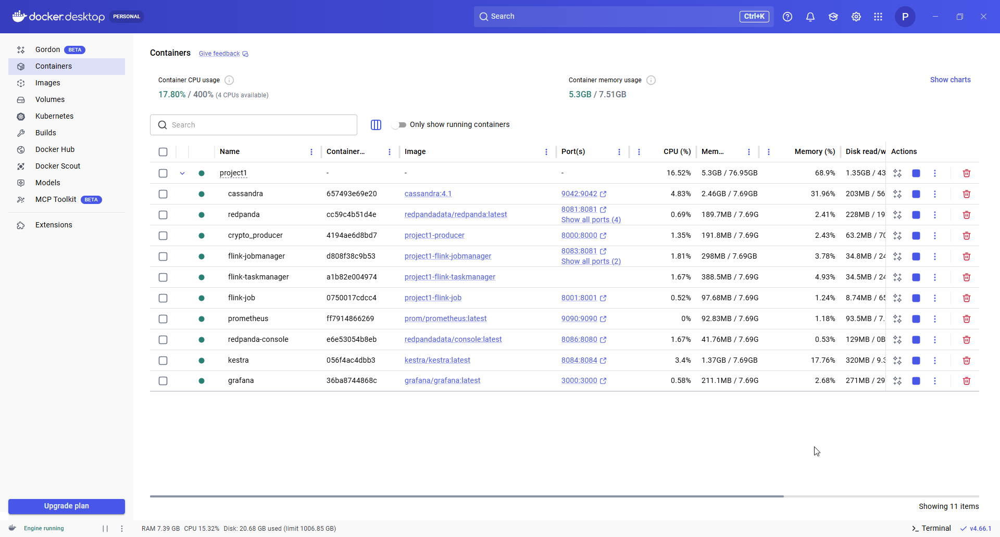
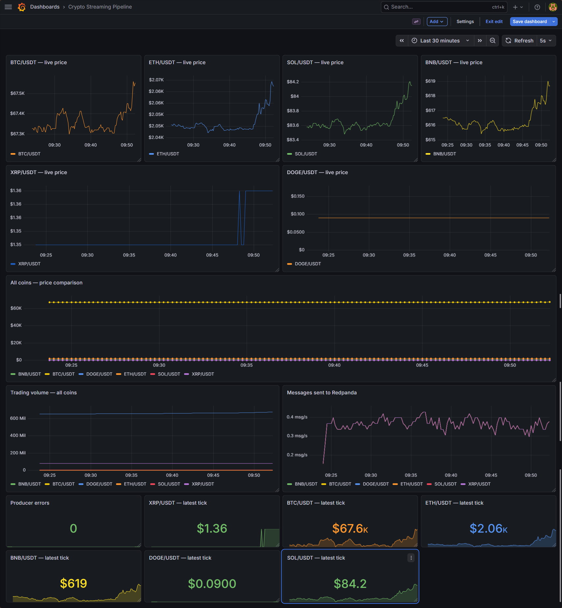
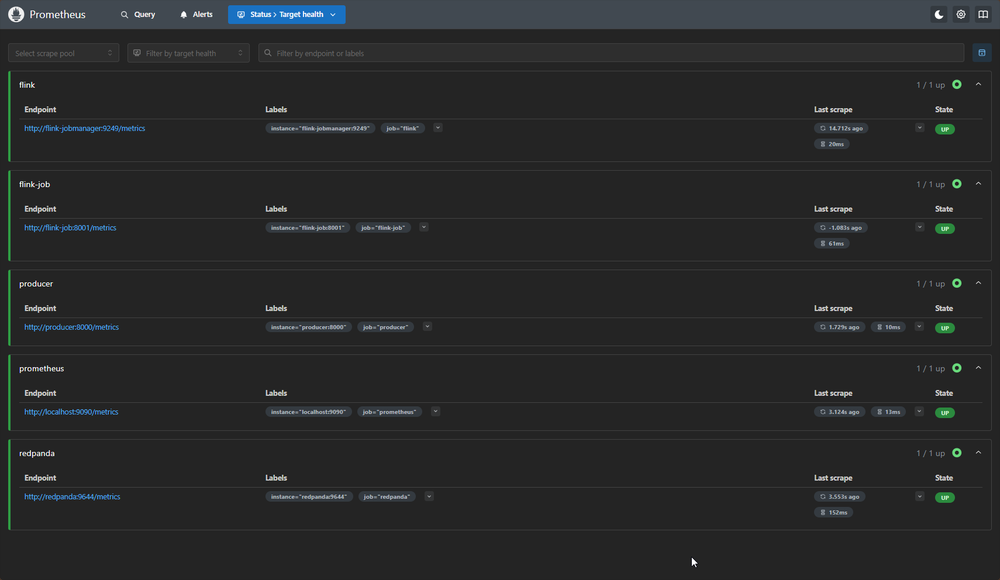
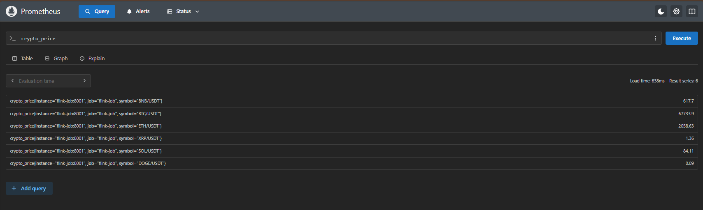
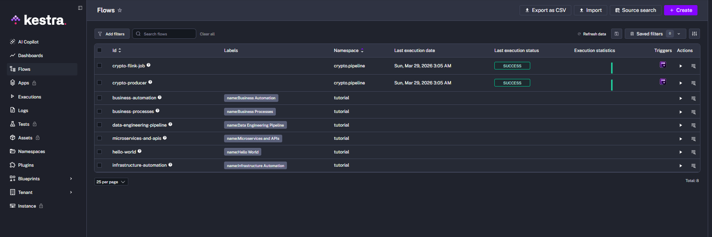
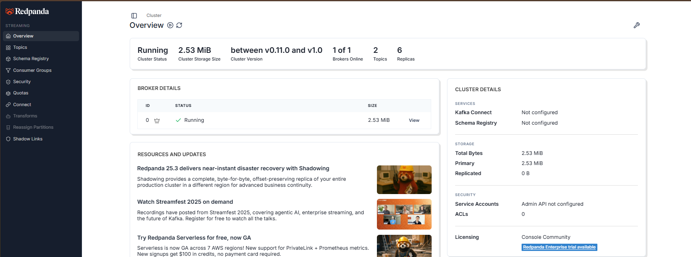
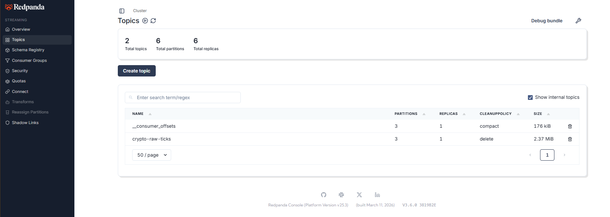
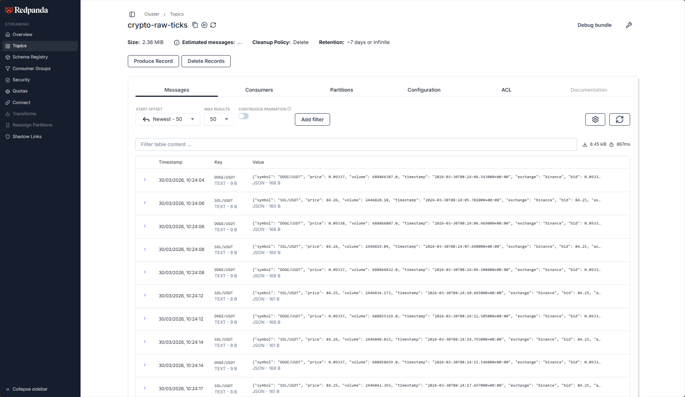
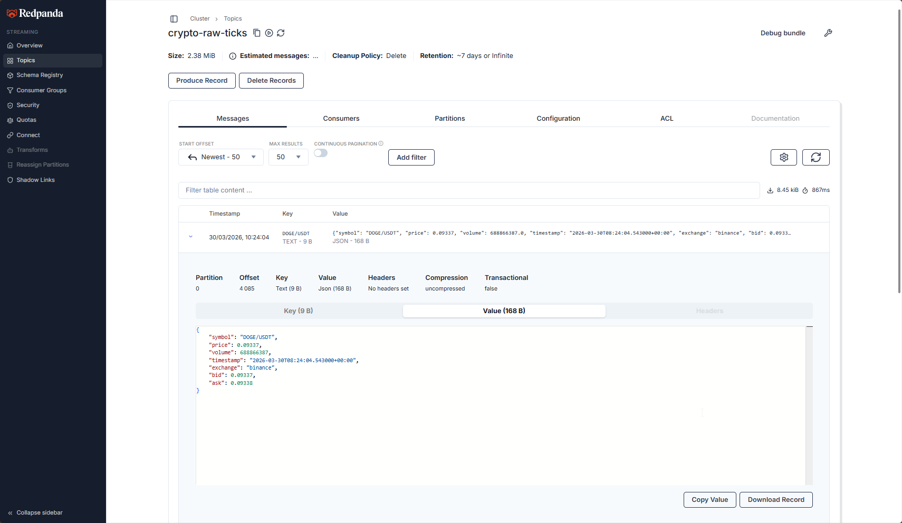

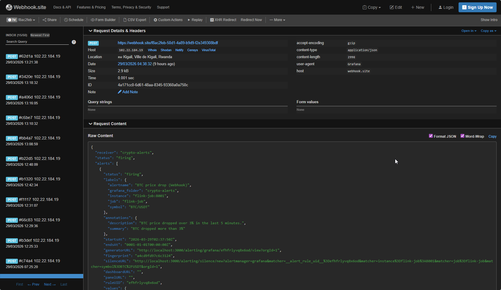
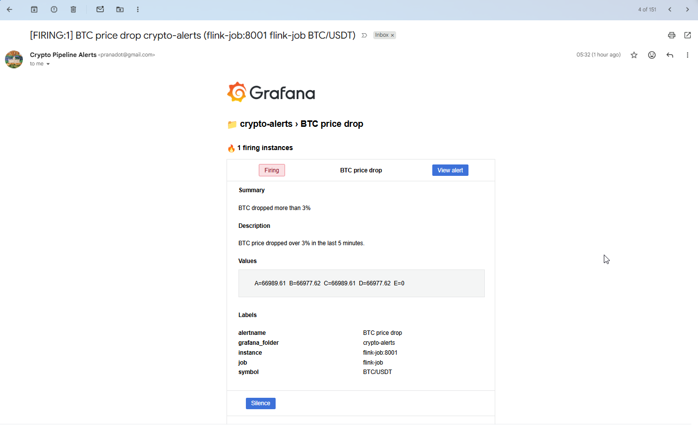
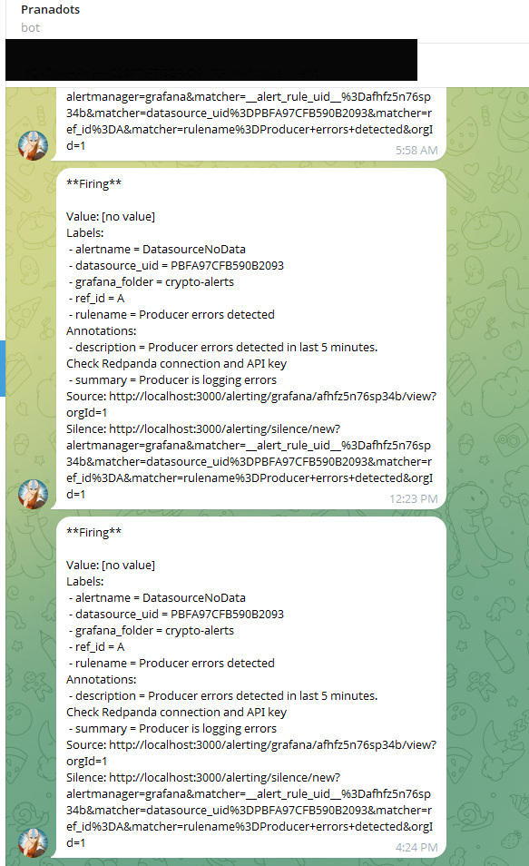

---

## Adding More Coins

Edit the `CRYPTO_SYMBOLS` environment variable in `docker-compose.yml` under the producer service:

```yaml
environment:
  - CRYPTO_SYMBOLS=BTC/USDT,ETH/USDT,SOL/USDT,BNB/USDT,XRP/USDT,DOGE/USDT,ADA/USDT,AVAX/USDT
```

Then restart the producer:

```bash
docker compose up -d producer
```

No other changes needed. The Flink job, Cassandra schema, and Grafana panels all handle new symbols dynamically.

---

## Stopping the Stack

```bash
# Stop all containers (data persists in Docker volumes)
docker compose stop

# Stop and remove containers (data persists)
docker compose down

# Stop and remove everything including volumes (data lost)
docker compose down -v
```

## Known Issues and Limitations

### DuckDB concurrent reads
DuckDB enforces a single-writer lock. While the Flink job holds the write lock, external tools (DBeaver, ad-hoc Python scripts) cannot open the file simultaneously. Use read-only mode as a workaround:

```python
conn = duckdb.connect('/data/crypto_history.duckdb', read_only=True)
```

Or copy the file out of the container for offline analysis:

```bash
docker cp flink-job:/data/crypto_history.duckdb ./crypto_snapshot.duckdb
```

### Kestra resource usage
Kestra requires significant RAM (2-4GB). On machines with limited resources, comment out the kestra service in `docker-compose.yml` and rely on `restart: unless-stopped` policies for auto-recovery instead.

### Windows Docker Desktop
Several Windows-specific workarounds are applied in this project:
- Single-file bind mounts for Prometheus config use a config subfolder (`./prometheus/config/`)
- Grafana configuration uses `grafana.ini` file mount instead of environment variables for SMTP
- All services use `restart: unless-stopped` to handle Docker Desktop engine restarts

---


## What I Learned

Building this project covered the full modern data engineering stack end to end:

- **Streaming architecture** — understanding the difference between real-time operational storage (Cassandra) and analytical storage (DuckDB), and why you need both
- **Kafka/Redpanda** — topics, partitions, consumer groups, offset management, and why consumer lag is the key health metric
- **Flink ETL patterns** — watermarking for late data, windowing for aggregation, exactly-once semantics, checkpointing
- **Cassandra data modelling** — designing tables around query patterns rather than normalisation, partition key selection, TTL management
- **Dual storage pattern** — Cassandra for operational queries, DuckDB for analytics, GCS for archival
- **Observability** — the difference between business metrics (crypto prices) and pipeline metrics (throughput, lag, errors), and why Prometheus + Grafana covers both
- **Terraform IaC** — provisioning cloud infrastructure reproducibly, GCP provider, output values
- **Docker Compose networking** — service discovery, bind mounts vs named volumes, Windows-specific quirks
- **Production patterns** — Pydantic validation at ingestion, anomaly detection mid-stream, alerting on both business events and infrastructure failures

---

## Roadmap / Future Improvements

- [ ] Resolve DuckDB concurrent read limitation with read-replica pattern or Parquet export
- [ ] Add Schema Registry (Avro) to Redpanda for stronger schema governance
- [ ] Implement proper PyFlink job submission to Flink cluster (currently runs as standalone Python consumer)
- [ ] Add ClickHouse as an alternative analytical store for SQL-based OHLCV analysis
- [ ] Build ML anomaly detection model with Flink ML for more sophisticated price spike detection
- [ ] Add CI/CD pipeline with GitHub Actions for automated testing
- [ ] Deploy to cloud (AWS EKS or GCP GKE) with Terraform

---

## Built With

This project was built as part of the [DataTalks Data Engineering Bootcamp Project](https://github.com/DataTalksClub/data-engineering-zoomcamp)