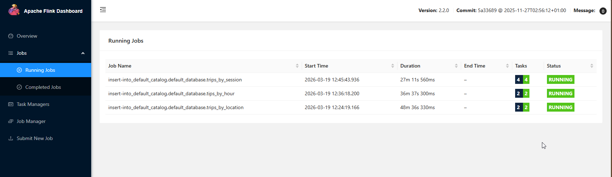
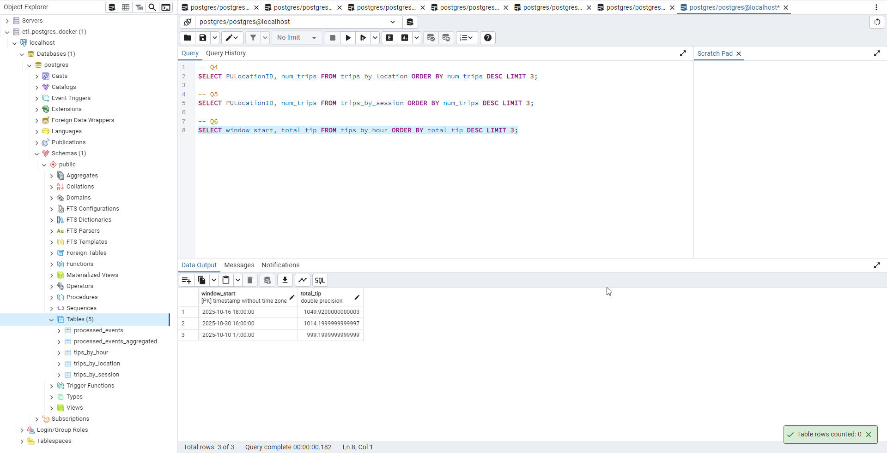

# Week 7 — PyFlink Stream Processing 🚕⚡

> *"What if your data never stopped moving?"*

This week we left the comfortable world of batch processing behind and stepped into
the fast lane — real-time stream processing with Apache Flink, Kafka (Redpanda),
and PostgreSQL. By the end, we built a pipeline that processes taxi trips the moment
they happen, aggregates them into time windows, and stores the results — automatically,
continuously, and fault-tolerantly.

**The pipeline we built:**
```
Producer (Python) → Kafka (Redpanda) → Flink → PostgreSQL
```

---

## Table of Contents

1. [What We Built](#what-we-built)
2. [Folder Structure](#folder-structure)
3. [Prerequisites](#prerequisites)
4. [The Workshop — Step by Step](#the-workshop--step-by-step)
   - [Stage 1: Redpanda — Your Message Broker](#stage-1-redpanda--your-message-broker)
   - [Stage 2: The Producer — Sending Data](#stage-2-the-producer--sending-data)
   - [Stage 3: The Consumer — Reading Data](#stage-3-the-consumer--reading-data)
   - [Stage 4: PostgreSQL — Saving Events](#stage-4-postgresql--saving-events)
   - [Stage 5: Flink — The Real Deal](#stage-5-flink--the-real-deal)
   - [Stage 6: Windowed Aggregation](#stage-6-windowed-aggregation)
5. [Homework — Green Taxi Data](#homework--green-taxi-data)
   - [Q1: Redpanda Version](#q1-redpanda-version)
   - [Q2: Sending Green Taxi Data](#q2-sending-green-taxi-data)
   - [Q3: Consumer — Trip Distance](#q3-consumer--trip-distance)
   - [Q4: Tumbling Window — Pickup Location](#q4-tumbling-window--pickup-location)
   - [Q5: Session Window — Longest Streak](#q5-session-window--longest-streak)
   - [Q6: Tumbling Window — Largest Tip](#q6-tumbling-window--largest-tip)
6. [Key Concepts Explained](#key-concepts-explained)
7. [Lessons Learned — The Hard Way](#lessons-learned--the-hard-way)
8. [Cleanup](#cleanup)

---

## What We Built

| Component | Technology | Role |
|---|---|---|
| Message Broker | Redpanda (Kafka-compatible) | Receives and stores messages |
| Producer | Python + kafka-python | Sends taxi trip data to Kafka |
| Consumer | Python + kafka-python | Reads messages from Kafka |
| Stream Processor | Apache Flink (PyFlink) | Windowed aggregations, transformations |
| Database | PostgreSQL | Stores processed results |
| Infrastructure | Docker Compose | Runs all services locally |
| SQL Client | pgAdmin | Inspects PostgreSQL results |

---

## Folder Structure

```
week7/
├── docker-compose.yml           ← All 4 services (Redpanda, PostgreSQL, Flink x2)
├── Dockerfile.flink             ← Custom Flink image with Python + connector JARs
├── pyproject.flink.toml         ← PyFlink dependencies (used inside Docker image)
├── flink-config.yaml            ← Flink JVM settings (increases metaspace for PyFlink)
├── pyproject.toml               ← Local Python project dependencies
├── .python-version              ← Pins Python 3.12 for uv
└── src/
    ├── models.py                ← Shared Ride dataclass + serializers
    ├── producers/
    │   ├── producer.py          ← Sends 1000 Nov 2025 yellow taxi rows to Kafka
    │   ├── producer_green.py    ← Sends Oct 2025 green taxi data (homework)
    │   └── producer_realtime.py ← Generates live synthetic rides with late events
    ├── consumers/
    │   ├── consumer.py          ← Reads from Kafka, prints to screen
    │   ├── consumer_postgres.py ← Reads from Kafka, writes to PostgreSQL
    │   └── consumer_green.py    ← Counts green trips with distance > 5 (homework Q3)
    └── job/
        ├── pass_through_job.py         ← Flink: Kafka → PostgreSQL (simple)
        ├── aggregation_job.py          ← Flink: Kafka → PostgreSQL (1hr tumbling window)
        ├── green_tumbling_location.py  ← Homework Q4: 5-min window by pickup location
        ├── green_session_window.py     ← Homework Q5: Session window by location
        └── green_tip_by_hour.py        ← Homework Q6: 1-hr window, total tip amount
```

---

## Prerequisites

- **Docker Desktop** — runs all infrastructure as containers
- **uv** — Python package manager (`pip install uv` or `winget install astral-sh.uv`)
- **pgAdmin** — GUI SQL client for inspecting PostgreSQL results
- **VS Code** — editor

---

## The Workshop — Step by Step

### Stage 1: Redpanda — Your Message Broker

Before any data can flow, you need somewhere to send it. Redpanda is a
Kafka-compatible message broker — think of it as a post office that receives
parcels (messages), stores them in labelled boxes (topics), and hands them
out to anyone who asks.

Why Redpanda instead of real Kafka? No JVM, no ZooKeeper, single container,
starts in seconds. For development it's perfect.

```powershell
cd week7
docker compose up redpanda -d
docker compose ps   # should show STATUS: Up
```

---

### Stage 2: The Producer — Sending Data

The producer reads NYC Yellow Taxi trip data (November 2025) and sends each
row as a JSON message to Kafka. It converts each row into a `Ride` dataclass,
serializes it to JSON bytes, and fires it into the `rides` topic.

```powershell
uv sync
uv run python src/producers/producer.py
```

You'll see 1000 rides scroll past over ~10 seconds. Each message is a taxi
trip flying through your pipeline in real time.

**Key concept:** The producer runs on your laptop (`localhost:9092`). When
Flink runs inside Docker later, it uses the internal address (`redpanda:29092`)
instead — two different addresses for the same broker, depending on who's asking.

---

### Stage 3: The Consumer — Reading Data

The consumer is the other side of the pipe. It reads messages back out of
Kafka and prints them. This is your proof that the producer is working.

```powershell
uv run python src/consumers/consumer.py
```

Notice the `auto_offset_reset='earliest'` setting — this means start reading
from the very beginning of the topic, not just new messages. Change it to
`latest` and you'd only see messages that arrive after the consumer starts.

**`group_id` matters:** Each consumer group tracks its own position in the
topic independently. The console consumer (`rides-console`) and the PostgreSQL
consumer (`rides-to-postgres`) both read every message because they have
different group IDs.

---

### Stage 4: PostgreSQL — Saving Events

Printing to the screen is fine for debugging. Let's persist the data.

```powershell
docker compose up postgres -d
```

Connect with **pgAdmin**: host `localhost`, port `5432`, user `postgres`,
password `postgres`. Open the Query Tool and create the table:

```sql
CREATE TABLE processed_events (
    PULocationID    INTEGER,
    DOLocationID    INTEGER,
    trip_distance   DOUBLE PRECISION,
    total_amount    DOUBLE PRECISION,
    pickup_datetime TIMESTAMP
);
```

Run the PostgreSQL consumer (Ctrl+C to stop):
```powershell
uv run python src/consumers/consumer_postgres.py
```

Verify:
```sql
SELECT count(*) FROM processed_events;
-- should return 1000
```

Clear before Flink:
```sql
TRUNCATE processed_events;
```

**Why move to Flink?** This works — but what if you wanted hourly totals?
Or to handle the consumer crashing mid-run? Or process 10 partitions in
parallel? You'd have to build all that yourself. Flink gives you all of it
for free.

---

### Stage 5: Flink — The Real Deal

This is where things get serious. Flink replaces your Python consumer entirely.
It reads from Kafka, applies transformations, and writes to PostgreSQL —
with automatic checkpointing, offset tracking, and parallelism.

Flink needs a custom Docker image because it requires Python support and
connector JARs (Kafka + JDBC + PostgreSQL driver). The first build takes
a few minutes.

```powershell
docker compose up --build -d
docker compose ps   # should show 4 services Up
```

Open the **Flink UI at http://localhost:8081** — you should see 1 TaskManager
with 15 available slots.

Submit the pass-through job:
```powershell
docker compose exec jobmanager ./bin/flink run `
    -py /opt/src/job/pass_through_job.py `
    --pyFiles /opt/src -d
```

> 💡 **Windows PowerShell note:** Use backtick `` ` `` for line continuation,
> not `\` (that's Linux/Mac bash syntax).

Since the job uses `latest-offset`, send data AFTER submitting:
```powershell
uv run python src/producers/producer.py
```

Check PostgreSQL:
```sql
SELECT count(*) FROM processed_events;
-- 1000 rows, inserted by Flink automatically
```

Same result as the Python consumer — but Flink handled checkpointing,
offset management, and all the inserts without a single line of psycopg2 code.

---

### Stage 6: Windowed Aggregation

Now for the power move. We group taxi trips into 1-hour tumbling windows and
compute trips + revenue per pickup location per hour. This is something that
would take serious effort to build with plain Python.

Cancel the pass-through job from the Flink UI, then create the aggregation table:

```sql
CREATE TABLE processed_events_aggregated (
    window_start    TIMESTAMP,
    PULocationID    INTEGER,
    num_trips       BIGINT,
    total_revenue   DOUBLE PRECISION,
    PRIMARY KEY (window_start, PULocationID)
);
```

Submit the aggregation job:
```powershell
docker compose exec jobmanager ./bin/flink run `
    -py /opt/src/job/aggregation_job.py `
    --pyFiles /opt/src -d
```

Send data:
```powershell
uv run python src/producers/producer.py
```

Wait ~15 seconds for windows to close, then:
```sql
SELECT window_start,
       count(*) as locations,
       sum(num_trips) as total_trips,
       round(sum(total_revenue)::numeric, 2) as revenue
FROM processed_events_aggregated
GROUP BY window_start
ORDER BY window_start;
```

The 1000 trips are now grouped into hourly buckets by pickup location.
Flink handled the windowing, the watermarks, the late event correction
via upsert, and the PostgreSQL writes. You wrote a SQL query. That's the deal.

---

## Homework — Green Taxi Data

The homework uses **NYC Green Taxi Trip data for October 2025**
(`green_tripdata_2025-10.parquet`) and asks 6 questions across the full pipeline.

**Important differences from the workshop:**
- Topic: `green-trips` instead of `rides`
- Datetime columns use `lpep_` prefix instead of `tpep_`
- Timestamps are strings (`"2025-10-01 04:30:14"`), not epoch milliseconds
- The dataset contains `NaN` values in `passenger_count` — must be handled!
- Always submit Flink jobs with `-p 1` (the topic has 1 partition)

---

### Q1: Redpanda Version

```powershell
docker exec -it week7-redpanda-1 rpk version
```

**Answer: version = 25.3.9** ✅

---

### Q2: Sending Green Taxi Data

First create the topic:
```powershell
docker exec -it week7-redpanda-1 rpk topic create green-trips
```

Run the green taxi producer and note the time printed at the end:
```powershell
uv run python src/producers/producer_green.py
```

**⚠️ Critical:** The producer must replace `NaN` values with `None` before
serializing to JSON. `NaN` is valid in pandas/parquet but **illegal in JSON**,
and Flink's deserializer will crash on it. The fix in the producer:

```python
record = {k: (None if isinstance(v, float) and v != v else v)
          for k, v in record.items()}
```

The `v != v` trick detects NaN because NaN is the only float that is not
equal to itself. Elegant and strange.

**Answer: took = 29.07 seconds** ✅
---

### Q3: Consumer — Trip Distance

```powershell
uv run python src/consumers/consumer_green.py
```

The consumer reads all messages from `green-trips` (earliest offset) and
counts how many trips have `trip_distance > 5.0`. Uses `consumer_timeout_ms=5000`
to auto-stop after 5 seconds of silence.

**Answer: Trips with distance > 5 = 8506** ✅
---

### Q4: Tumbling Window — Pickup Location

**Goal:** Find which `PULocationID` had the most trips in a single 5-minute window.

Create the result table in pgAdmin:
```sql
CREATE TABLE trips_by_location (
    window_start  TIMESTAMP,
    PULocationID  INTEGER,
    num_trips     BIGINT,
    PRIMARY KEY (window_start, PULocationID)
);
```

Submit with `-p 1`:
```powershell
docker exec -it week7-jobmanager-1 flink run -p 1 -py /opt/src/job/green_tumbling_location.py
```

Wait 2 minutes, then query:
```sql
SELECT PULocationID, num_trips
FROM trips_by_location
ORDER BY num_trips DESC
LIMIT 3;
```

**Answer: PULocationID = 74** ✅

---

### Q5: Session Window — Longest Streak

**Goal:** Find the session (group of trips with < 5-minute gaps) with the
most trips, for any pickup location.

Create the result table:
```sql
CREATE TABLE trips_by_session (
    window_start  TIMESTAMP,
    window_end    TIMESTAMP,
    PULocationID  INTEGER,
    num_trips     BIGINT,
    PRIMARY KEY (window_start, PULocationID)
);
```

Submit with `-p 1`:
```powershell
docker exec -it week7-jobmanager-1 flink run -p 1 -py /opt/src/job/green_session_window.py
```

Query:
```sql
SELECT PULocationID, num_trips
FROM trips_by_session
ORDER BY num_trips DESC
LIMIT 5;
```

**⚠️ This question was the hardest of the homework** — see Lessons Learned below.

---

### Q6: Tumbling Window — Largest Tip

**Goal:** Find the 1-hour window with the highest total `tip_amount` across
all locations.

Create the result table:
```sql
CREATE TABLE tips_by_hour (
    window_start  TIMESTAMP,
    total_tip     DOUBLE PRECISION,
    PRIMARY KEY (window_start)
);
```

Submit with `-p 1`:
```powershell
docker exec -it week7-jobmanager-1 flink run -p 1 -py /opt/src/job/green_tip_by_hour.py
```

Query:
```sql
SELECT window_start, total_tip
FROM tips_by_hour
ORDER BY total_tip DESC
LIMIT 3;
```
 **Answer: window_start = 2025-10-16 18:00:00** ✅
---

## Key Concepts Explained

### Kafka / Redpanda
- **Topic** — a named channel. Like a folder where all messages of one type live.
- **Offset** — your position in a topic. Like a bookmark. Kafka remembers where each consumer group got to.
- **`earliest` vs `latest`** — start reading from the beginning of history, or only new messages going forward.
- **Producer** — writes to a topic. **Consumer** — reads from a topic.

### Apache Flink
- **Streaming mode** — the job runs forever, processing events as they arrive.
- **Checkpointing** — Flink periodically snapshots its state (including Kafka offsets) to disk. If it crashes, it restarts from the last snapshot instead of losing progress.
- **Watermark** — tells Flink how long to wait for late-arriving events before closing a window. `event_timestamp - INTERVAL '5' SECOND` means "the current time is always 5 seconds behind the latest event I've seen."
- **Tumbling window** — fixed-size, non-overlapping time buckets. Every event belongs to exactly one window.
- **Session window** — closes after a gap of inactivity. Groups bursts of events together regardless of clock time.
- **Parallelism** — how many subtasks run in parallel. With 1 Kafka partition, always use `parallelism=1` or idle subtasks will block the watermark from advancing.
- **Upsert (PRIMARY KEY)** — when Flink re-evaluates a window due to a late event, it sends an UPDATE instead of a duplicate INSERT. The `PRIMARY KEY` on the sink table makes this work.

### The Parallelism Trap
This is the single most important lesson from this week. When Flink runs a
job with parallelism 3 (the cluster default) but the Kafka topic has only
1 partition, here's what happens:

```
Subtask 1 → assigned to partition 0 → reads data → emits watermarks ✅
Subtask 2 → assigned to nothing    → idle forever → never emits watermark ❌
Subtask 3 → assigned to nothing    → idle forever → never emits watermark ❌
```

Flink advances the watermark only when ALL subtasks agree. Two idle subtasks
mean the watermark never advances, windows never close, and nothing ever
gets written to PostgreSQL. The job runs perfectly — and produces nothing.

**The fix:** Always use `-p 1` when submitting jobs for single-partition topics:
```powershell
docker exec -it week7-jobmanager-1 flink run -p 1 -py /opt/src/job/your_job.py
```

---

## Lessons Learned — The Hard Way

### 🔴 Lesson 1: NaN is not null, and JSON hates NaN
The green taxi dataset has `NaN` in `passenger_count`. Python's pandas reads
it fine. JSON does not — it's not a valid JSON token. Flink's deserializer
hits it and crashes with:

```
Non-standard token 'NaN': enable JsonReadFeature.ALLOW_NON_NUMERIC_NUMBERS
```

**Fix:** Replace NaN with None in the producer before serializing.
Or simply drop columns you don't need from the DDL — if `passenger_count`
isn't in the Flink source table, Flink ignores it entirely.

---

### 🔴 Lesson 2: The parallelism trap kills your windows silently
The job runs. It looks healthy. Checkpoints succeed. Records are received.
But nothing ever reaches PostgreSQL. No error. No warning. Just silence.

The cause: cluster default parallelism (3) overriding your job setting (1).
The symptom: `(1/3)`, `(2/3)`, `(3/3)` in the Flink logs for a 1-partition topic.

**Fix:** Use `-p 1` on the command line. It overrides everything.

---

### 🔴 Lesson 3: Always TRUNCATE before rerunning — but only after cancelling
If you TRUNCATE a table while a Flink job is still writing to it, the job
wins — it will write the data back before you can query it. Always cancel
the job first, then truncate, then verify `COUNT(*) = 0`, then resubmit.

---

### 🔴 Lesson 4: Duplicate topic data corrupts all window results
If you run the producer twice without deleting the topic, you have 2x the
data. Every window count will be doubled. Every aggregation will be wrong.

**The clean reset pattern:**
```powershell
docker exec -it week7-redpanda-1 rpk topic delete green-trips
docker exec -it week7-redpanda-1 rpk topic create green-trips
uv run python src/producers/producer_green.py
```

---

### 🔴 Lesson 5: Python indentation errors crash the whole Flink job
Flink submits your `.py` file to a Python process inside the container.
If that file has a syntax error or indentation error, the process exits
with code 1 and the job vanishes instantly with no helpful Flink UI message.

Always check your Python files in VS Code before submitting. The error
will appear in the PowerShell output when you run the `flink run` command.

---

### 🟡 Lesson 6: pgAdmin runs all highlighted SQL, not just one statement
When you have multiple SQL statements in the Query Tool and press F5,
pgAdmin runs ALL of them and shows only the last result. If you want to
check `COUNT(*)` after a `TRUNCATE`, highlight just the COUNT line before
pressing F5.

---

### 🟢 Lesson 7: When in doubt, watch the Flink UI job graph
The job graph tells you everything:
- **Parallelism: 1** on every box = ✅ correct
- **Parallelism: 3** on a 1-partition source = 🔴 watermark blocked
- **Red boxes** = tasks failed or cancelled
- **Low Watermark advancing** = windows will eventually close and flush

---

### 🟢 Lesson 8: Streaming is powerful but expensive to operate
A Flink job runs 24/7. If it crashes at 3 AM, someone has to fix it.
For most data engineering use cases, hourly batch or 15-minute micro-batch
is enough and far easier to maintain. Only use streaming when something
automated needs to react in real time — fraud detection, surge pricing,
live dashboards.



---

## Cleanup

Stop all containers:
```powershell
docker compose down
```

Stop all containers AND delete the PostgreSQL data volume:
```powershell
docker compose down -v
```

---

## Quick Reference — All Commands

### Infrastructure
```powershell
docker compose up --build -d          # build Flink image and start everything
docker compose up redpanda -d         # start only Redpanda
docker compose up postgres -d         # start only PostgreSQL
docker compose ps                     # check all service statuses
docker compose down                   # stop everything
docker compose down -v                # stop + delete volumes
docker compose logs jobmanager --tail=50    # Flink job manager logs
docker compose logs taskmanager --tail=50   # Flink task manager logs
```

### Redpanda / Kafka
```powershell
docker exec -it week7-redpanda-1 rpk version
docker exec -it week7-redpanda-1 rpk topic create green-trips
docker exec -it week7-redpanda-1 rpk topic delete green-trips
docker exec -it week7-redpanda-1 rpk topic describe green-trips
```

### Flink Jobs
```powershell
# Submit a job (stays running, blocks terminal)
docker exec -it week7-jobmanager-1 flink run -p 1 -py /opt/src/job/your_job.py

# Submit a job (detached, returns immediately)
docker exec -it week7-jobmanager-1 flink run -p 1 -py /opt/src/job/your_job.py -d

# List running jobs
docker exec -it week7-jobmanager-1 flink list

# Cancel a job
# → Use the Flink UI at http://localhost:8081 → click job → Cancel Job
```

### Python Scripts
```powershell
uv sync                                              # install dependencies
uv run python src/producers/producer.py              # send yellow taxi data
uv run python src/producers/producer_green.py        # send green taxi data
uv run python src/consumers/consumer.py              # read from Kafka, print
uv run python src/consumers/consumer_postgres.py     # read from Kafka, write to PG
uv run python src/consumers/consumer_green.py        # count trips > 5km (homework Q3)
```

### pgAdmin Connection
| Field | Value |
|---|---|
| Host | `localhost` |
| Port | `5432` |
| Database | `postgres` |
| Username | `postgres` |
| Password | `postgres` |